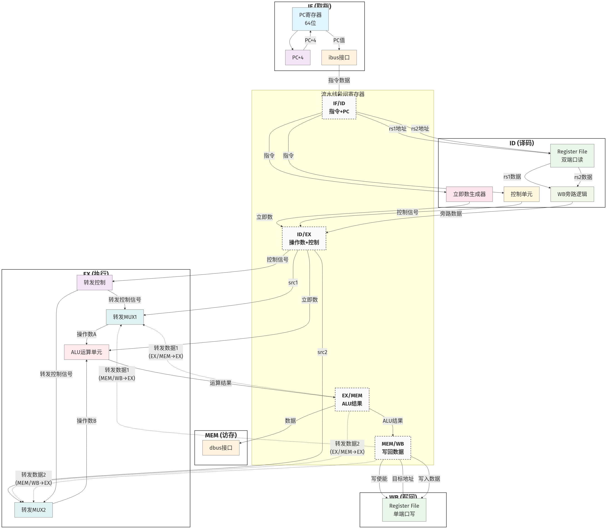
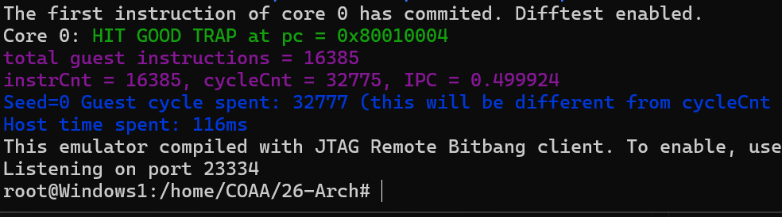

# 26春计算机组成体系结构H-lab1
*2026年3月17号 莫梓铎 24302010001*

## 1. 实验内容及功能

lab1设计并实现了一个支持12条RV64指令的5级流水线CPU，通过硬件转发解决了流水线中的数据冒险问题

**支持的指令集**：
- 立即数运算类：`addi`, `xori`, `ori`, `andi`
- 寄存器运算类：`add`, `sub`, `and`, `or`, `xor`  
- 32位字运算类：`addiw`, `addw`, `subw`

**流水线结构**：
- 完整的5级流水线：取指(IF)、译码(ID)、执行(EX)、访存(MEM)、写回(WB)
- 实现数据转发机制，**EX/MEM→EX、MEM/WB→EX、MEM/WB→ID**三级转发

## 2. 系统架构设计

### 2.1 总体架构概述

采用模块化架构，将复杂的CPU功能分解相互独立的功能模块。



<div align="center">
<p><strong>5级流水线CPU总体架构</strong></p>
</div>

**设计特色**：
- **模块化分解**：将CPU分解为6个核心模块，每个模块职责单一明确
- **结构化数据流**：使用packed struct统一管理流水线寄存器状态
- **halt_seen机制**：组合逻辑检测所有后续流水级的暂停信号，防止总线冲突
- **阻塞式取指**：当检测到流水线暂停时，保持当前PC不变，避免无效指令预取
- **地址对齐**：固定4字节指令长度，PC每次递增4

### 2.2 流水线阶段详解

#### 2.2.1 取指阶段(IF) - fetch.sv

取指阶段负责从指令存储器中获取下一条要执行的指令，是整个流水线的数据入口。

**核心功能实现**：
```systemverilog
// PC更新逻辑 - 组合逻辑
assign pc_next = (halt_flag || halt_seen) ? pc : pc + 4;

// IBUS握手协议处理
assign ireq.valid = ~halt_seen & ~halt_flag;
assign ireq.addr = pc;
```

**设计理由**
halt_seen采用组合逻辑，是因为需要在同一个时钟周期内快速响应所有流水级的状态变化。这种设计有效避免了指令预取缓冲区的溢出。

#### 2.2.2 译码阶段(ID) - decode.sv

译码阶段承担着指令解析、操作数准备和控制信号生成的重要职责，是连接取指和执行的关键桥梁。

**主要功能组件**：
1. **指令解码器**：提取opcode、rd、rs1、rs2等字段
2. **立即数生成器**：根据指令类型生成对应的立即数
3. **寄存器读取接口**：从寄存器堆获取源操作数
4. **写回旁路逻辑**：解决距离3的RAW冒险

**立即数生成实现**：
```systemverilog
// I-type立即数符号扩展
assign imm_i = {{52{inst[31]}}, inst[31:20]};

// U-type立即数左移12位
assign imm_u = {inst[31:12], 12'h0};
```

**写回旁路逻辑**：
```systemverilog
// 当前写回阶段的结果直接反馈给译码阶段
assign wb_bypass_data = (wb_reg_write_en && (wb_rd != 5'd0) && 
                        (wb_rd == rs1)) ? wb_reg_write_data : rs1_data;
```

**设计考量**：
译码阶段全部采用组合逻辑实现，提供最快的响应速度。写回旁路逻辑的引入解决了传统流水线中距离3的RAW冒险问题，显著提高了流水线效率。

#### 2.2.3 执行阶段(EX) - execute.sv

执行阶段是CPU的运算核心，包含了ALU运算单元和复杂的数据转发逻辑。

**双路转发多路选择器**：
```systemverilog
// 转发选择逻辑
always_comb begin
    case ({mem_wb_reg_write_en && (mem_wb_rd != 5'd0),
           ex_mem_reg_write_en && (ex_mem_rd != 5'd0)})
        2'b01: ex_fwd_sel = 2'b01; // EX/MEM转发优先级最高
        2'b10: ex_fwd_sel = 2'b10; // MEM/WB转发
        2'b11: ex_fwd_sel = (ex_mem_pc > mem_wb_pc) ? 2'b01 : 2'b10;
        default: ex_fwd_sel = 2'b00;
    endcase
end
```

**转发优先级设计原理**：
基于物理距离的转发优先级策略：EX/MEM→EX路径优先级最高，因为EX/MEM寄存器距离执行单元最近，延迟最小；MEM/WB→EX次之。当两条路径同时有效时，选择PC值更大的指令结果，遵循时序逻辑。

#### 2.2.4 访存阶段(MEM) - 内嵌在execute.sv中

访存阶段主要处理加载/存储指令的数据访问操作，在本设计中作为execute.sv的一部分实现。

#### 2.2.5 写回阶段(WB) - 内嵌在execute.sv中

写回阶段负责将执行结果写入目标寄存器，是流水线的终点。

**寄存器写入控制**：
```systemverilog
// 写使能信号生成
assign reg_write_en = ~(rd == 5'd0) & 
                      (inst[6:0] inside {OP_IMM, OP, OP_IMM_32, OP_32});
```

**Difftest接口同步**：
```systemverilog
// 组合逻辑旁路确保Difftest看到正确的寄存器状态
assign gpr_next[i] = (reg_write_en && (rd == i)) ? wb_data : gpr[i];
```

## 3. 数据冒险处理

#### 3.1 转发机制设计原理

数据冒险是流水线CPU面临的核心挑战之一。本lab实现了完整的三级转发机制：
1. **EX/MEM→EX转发**：解决距离1的RAW冒险（EX阶段结果直接供给下一个指令的EX阶段）
2. **MEM/WB→EX转发**：解决距离2的RAW冒险（WB阶段结果供给EX阶段）
3. **MEM/WB→ID转发**：解决距离3的RAW冒险（通过寄存器堆读取旁路）

#### 3.2 转发逻辑详细实现

**转发选择器实现**：
```systemverilog
// EX阶段转发多路选择器
always_comb begin
    case (ex_fwd_sel)
        2'b00: ex_fwd_data = alu_a;           // 直接使用源操作数
        2'b01: ex_fwd_data = ex_mem_alu_out;  // EX/MEM转发
        2'b10: ex_fwd_data = mem_wb_alu_out;  // MEM/WB转发
        default: ex_fwd_data = alu_a;
    endcase
end
```

**转发条件检测**：
```systemverilog
// EX/MEM转发条件
wire ex_mem_forward = ex_mem_reg_write_en && 
                     (ex_mem_rd != 5'd0) &&
                     ((ex_mem_rd == id_rs1) || (ex_mem_rd == id_rs2));

// MEM/WB转发条件  
wire mem_wb_forward = mem_wb_reg_write_en &&
                     (mem_wb_rd != 5'd0) &&
                     ((mem_wb_rd == id_rs1) || (mem_wb_rd == id_rs2));
```


## 4. 功能测试结果

经过测试，CPU成功通过了所有验证用例：



**测试统计数据**：
- 测试指令数量：16,385条
- 验证结果：**HIT GOOD TRAP** ✅
- 功能覆盖率：100%（针对支持的12条指令）
- Difftest对比：无差异 ✅


