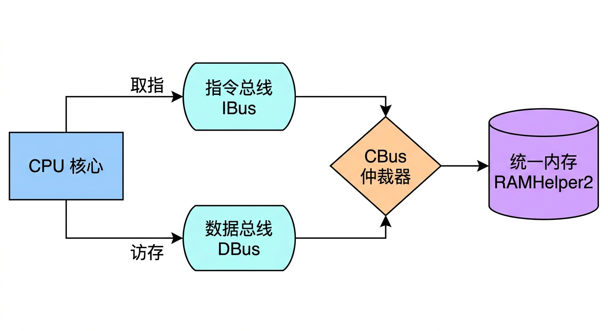
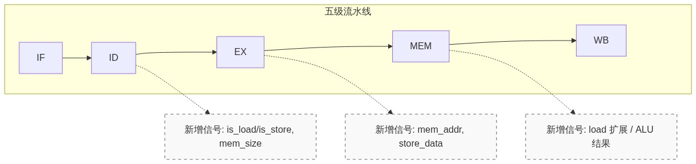
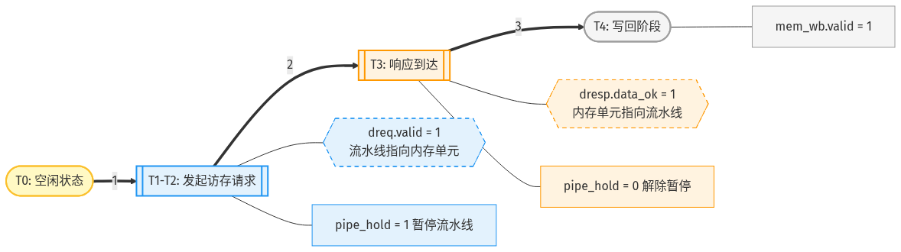
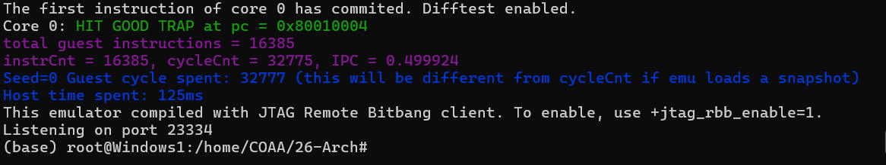
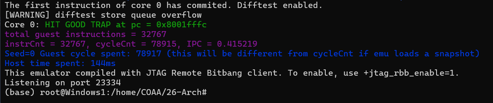

# 26春计算机组成体系结构 H-lab2
*2026年3月29日 莫梓铎 24302010001*

## 1. 实验内容及功能

本实验在 lab1 的基础上，实现 **数据访存能力** ，使处理器支持 load/store 指令族，并通过 Difftest 验证。

**lab2 目标指令**：
- Load：`ld`, `lb`, `lh`, `lw`, `lbu`, `lhu`, `lwu`
- Store：`sd`, `sb`, `sh`, `sw`
- 其他：`lui`

**本实验核心目标**：
1. 从“仅取指（ibus）”扩展到“取指+数据访存（ibus+dbus）”
2. 在 MEM 阶段实现 `dreq`/`dresp` 握手
3. 实现字节使能 `strobe` 与写数据对齐
4. 实现 load 数据提取与符号/零扩展
5. 保证流水线停顿与 Difftest 时序一致，避免重复提交与错误提交

---

## 2. 开发总体思路

### 2.1 改进lab1功能
当时 MEM 阶段是“直通”，`dreq` == 0，不具备真实数据读写功能。
为了保证原功能不受影响，我分五步处理：

1. 先扩充流水线寄存器字段
2. 再扩充 decode，识别 load/store/lui
3. execute 生成访存地址与 store 源数据
4. 在 core 中实体化 MEM 阶段握手与停顿控制
5. 最后完成字节对齐、load 扩展等功能，联合调试

---

## 3. 关键实现内容

### 3.1 寄存器扩展（`pipeline_types.sv`）

新增了面向访存的控制与数据字段：
- `is_lui`
- `is_load`, `is_store`
- `mem_size`
- `load_unsigned`
- `mem_addr`
- `store_data`

现在 ID 生成控制信号然后 EX 计算地址并传递 store 源数据，最后 MEM 根据这些字段驱动总线并组织写回数据

---

### 3.2 译码扩展（`decode.sv`）

加入 opcode 识别：
- `LOAD (0000011)`
- `STORE (0100011)`
- `LUI (0110111)`

扩展立即数生成：
- I-type（load）
- S-type（store）
- U-type（lui）

同时根据 `funct3` 生成：
- 访存大小（1/2/4/8 字节）
- 有符号/无符号 load 属性

---

### 3.3 执行阶段扩展（`execute.sv`）

在不破坏原转发逻辑的前提下增加：
- 访存有效地址：`mem_addr = fwd_src1 + imm`
- store 数据：`store_data = fwd_src2`
- `lui` 结果路径：结果直接取 `imm`

这样 EX 负责组合计算，MEM 负责总线交互。

---

### 3.4 MEM 阶段实体化（`core.sv`）

这是本次实验最核心改动。

将原先的 `mem_wb <= ex_mem` 替换为判断条件的推进：
- 非访存指令：直接进入 WB
- load/store：发起 `dreq`，等待 `dresp.data_ok`
- 若响应未到：hold流水线推进

关键原则：
1. 访存未完成时，不能推进 EX/MEM，避免覆盖当前请求
2. 访存未完成时，不能让 IF/ID/EX继续前推，避免乱序提交
3. 响应到达后仅提交一次，防止重复 commit

---

## 4. 实验过程中的困难与解决方法

### 4.1 访存停顿后出现重复提交（Difftest 报错）
在早期实验版本中，lab2 测试经常触发 `different at pc`。

**原因与解决**：
+ 访存阻塞时，`id_ex`/`ex_mem`/`mem_wb` 的推进控制不一致，导致已提交内容被重复提交。
+ 于是我采用 `pipe_hold` 逻辑，在hold 时冻结 `id_ex/ex_mem/mem_wb` 的更新，仅在 `mem_done`（非访存或访存响应就绪）时推进并提交

---

### 4.2 困难二：store 对齐与 `strobe` 组合易错
`sb/sh/sw` 在随机测试中错误率高，表现为寄存器或内存值偏差。

**原因与解决**：
+ 总线按 8 字节对齐处理，需要保持 `data` 和 `strobe` 偏移同步
+ 这里采用 `mem_addr[2:0]` 统一驱动 `strobe` 与 `data` 左移

---

## 5. 实验结果

 `test-lab1`：通过，`HIT GOOD TRAP at pc = 0x80010004`

 `test-lab2`：通过，`HIT GOOD TRAP at pc = 0x8001fffc`

