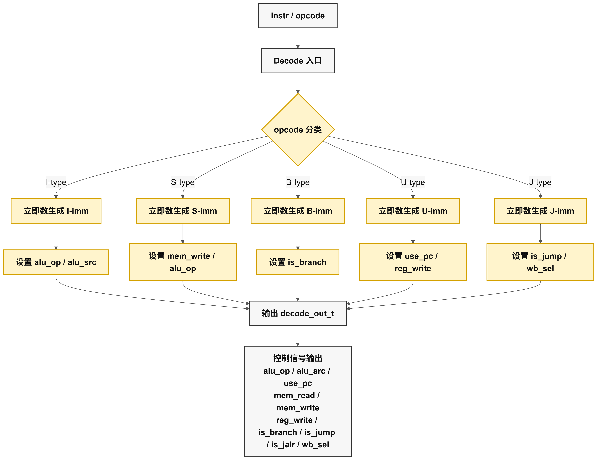
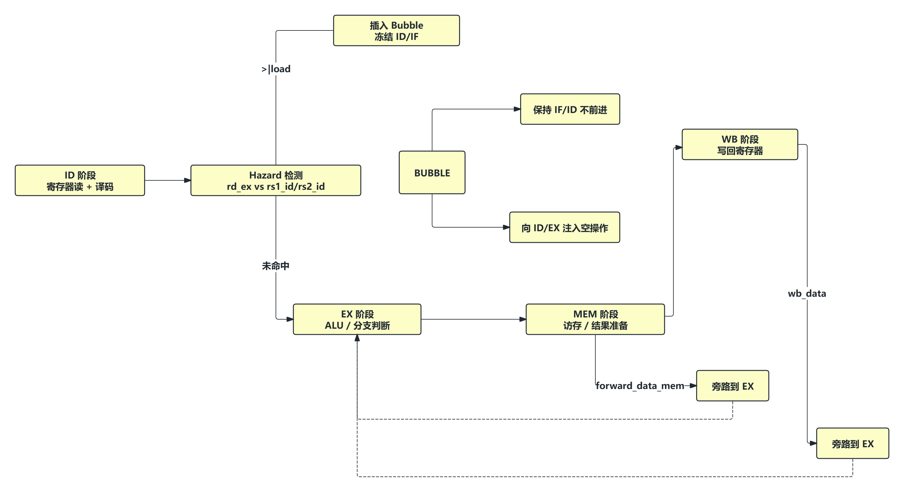
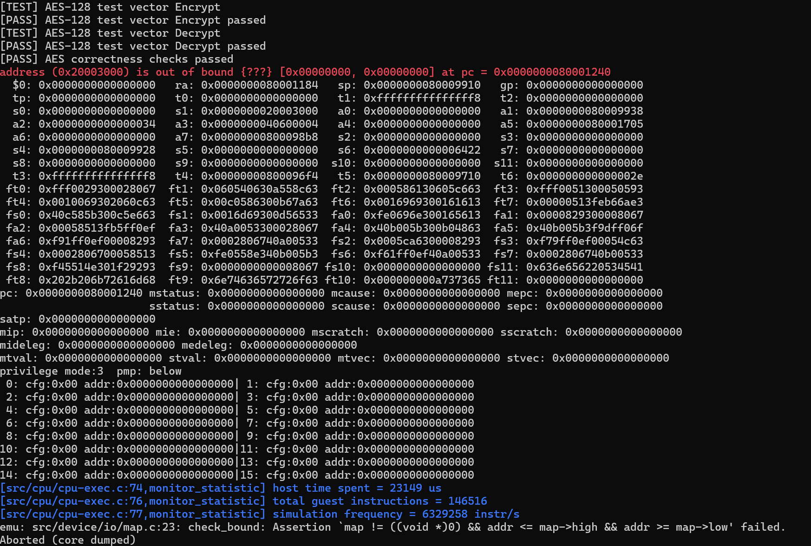
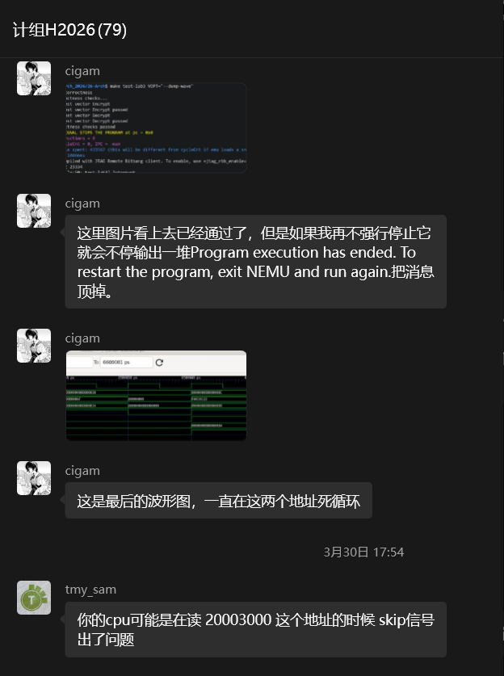
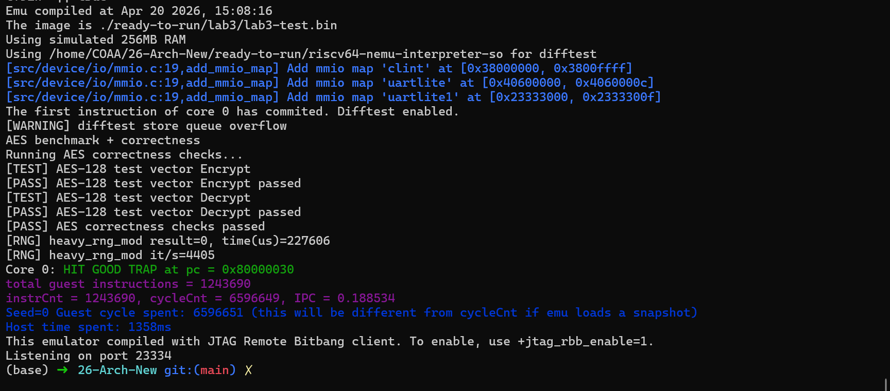
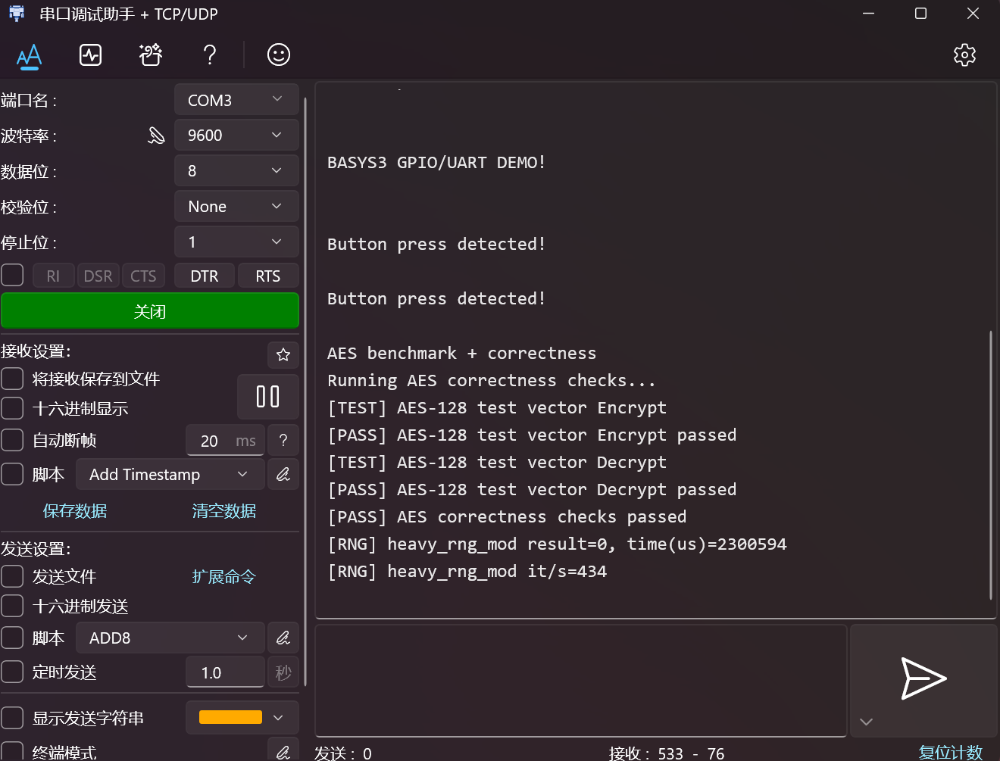

## 26春计算机组成体系结构 H-lab3
#### ~~真的好难😢~~ 我还是太菜了🤡

> 莫梓铎 24302010001

### 1.实验目标

本次实验要求 CPU 支持以下指令并通过测试：

- 条件分支：`beq`, `bne`, `blt`, `bge`, `bltu`, `bgeu`
- 立即数比较与位移：`slti`, `sltiu`, `slli`, `srli`, `srai`
- 寄存器运算：`sll`, `slt`, `sltu`, `srl`, `sra`
- RV64W 指令：`slliw`, `srliw`, `sraiw`, `sllw`, `srlw`, `sraw`
- 跳转与地址生成：`auipc`, `jalr`, `jal`


### 2. 开发总体思路

### 2.1 在原流水线基础上扩展控制流

lab2 已经实现了基本的 load/store 数据通路，因此 lab3 的重点不再是访存，而是让 CPU 能正确处理控制流变化：

- 分支是否成立
- 跳转目标地址如何计算
- 跳转后如何冲刷流水线
- 与 load/use hazard、访存等待同时出现时如何保持提交正确性

因此我延续了之前的五级流水结构，在 `ID` 阶段负责译码，在 `EX` 阶段完成比较、跳转判断和目标地址生成，在 `MEM/WB` 阶段继续完成访存、写回和 Difftest 提交。

.png>)

### 2.2 值得注意的点

1. **集中译码**：将指令类型识别、立即数生成和控制信号生成统一放在 decode 中。
2. **执行阶段统一处理跳转**：分支比较和跳转目标在 EX 阶段计算，便于结合旁路结果做判断。
3. **Difftest 提交与 WB 阶段对齐**：只在指令真正提交时向 Difftest 发送 commit 事件，避免重复提交或错位。

---

## 3. 实现内容

### 3.1 指令译码扩展（`cpu_decode.sv`）

本次实验中，decode 负责识别更多 opcode，并生成统一的控制信号结构 `decode_out_t`。

#### 3.1.1 立即数生成

根据不同类型指令分别生成：

- I-type：`slti`, `sltiu`, `slli`, `srli`, `srai`, `jalr` 等
- S-type：store 指令
- B-type：branch 指令
- U-type：`lui`, `auipc`
- J-type：`jal`

#### 3.1.2 控制信号生成

译码阶段产生以下信号：

- `alu_op`，`alu_src`，`use_pc`，`mem_read`，`mem_write`，`reg_write`，`is_branch`，`is_jump`，`is_jalr`，`wb_sel`

其中：

- `is_branch` 表示该指令是条件分支
- `is_jump` 表示该指令是跳转类指令
- `is_jalr` 用于区分 `jalr` 与 `jal`
- `use_pc` 用于 `auipc`
- `wb_sel` 用于选择写回来源（ALU / MEM / PC+4）




### 3.2 执行阶段扩展（`cpu_alu.sv` 与 `core.sv`）

#### 3.2.1 ALU 扩展

ALU 支持了：

- 基本算术逻辑运算：`ADD`, `SUB`, `AND`, `OR`, `XOR`
- 移位运算：`SLL`, `SRL`, `SRA`
- 比较运算：`SLT`, `SLTU`
- RV64W 运算：`ADDW`, `SUBW`, `SLLW`, `SRLW`, `SRAW`

其中 `W` 类操作先在低 32 位上运算，再进行符号扩展到 64 位。

#### 3.2.2 分支判断

对 `beq`, `bne`, `blt`, `bge`, `bltu`, `bgeu` 在 EX 阶段完成比较：

- `beq` / `bne` 使用相等比较
- `blt` / `bge` 使用有符号比较
- `bltu` / `bgeu` 使用无符号比较

#### 3.2.3 跳转目标生成

- `jal` 的目标地址为 `pc + imm`
- `jalr` 的目标地址为 `(rs1 + imm) & ~1`
- `auipc` 则使用 `pc + imm` 作为计算结果写回寄存器

当分支成立或跳转指令到达 EX 阶段后，产生 redirect 信号，冲刷流水线并更新 PC。


### 3.3 旁路与冒险控制

我在这次lab中保留了 forwarding 机制：

- 从 MEM 阶段向 EX 阶段转发 ALU 结果或 `PC+4`
- 从 WB 阶段向 EX 阶段转发最终写回值

同时保留 load-use hazard 检测，这样可以避免对尚未返回数据的 load 做错误使用。



## 4. 实验过程中反复出现的 `0x20003000 out of bound` 问题😭

在 lab3 的开发过程中，我遇到了一个比较顽固的错误：在基于前两个实验版本继续迭代时，测试虽然能够推进到后期，但程序最终总会在同一个位置附近触发越界访问，报出如下信息：

```text
address (0x20003000) is out of bound {???} [0x00000000, 0x00000000] at pc = 0x0000000080001240
```

这个问题非常难排查。我尝试过很多办法，包括：

- 在原本的 `.sv` 文件中加入打印语句，追踪指令提交和地址变化；
- 重定位和核对内存映射；
- 反复检查访存地址、分支目标和跳转路径；

#### 但是在很长一段时间内，这个问题始终没有被真正解决，调试过程也一度陷入停滞。😵



####  群聊排查与时序推测

在遇到上述问题后，我又去微信群里翻看聊天记录，发现也有同学在 `0x20003000` 附近遇到过类似问题。


后来，我和同学进一步交流后发现：他们大多数人并没有遇到这个错误。于是我阅读了他们的 `core.sv` 等核心文件，开始怀疑问题并不是简单的地址映射错误，而更可能是我之前lab设计的**流水线时序**存在遗留问题。

仔细分析后，我认为更可疑的点主要有：
- `redirect` 的触发时机不对；
- `stall` 与 `mem_wait`、`fetch_wait` 的组合关系有错；
- `Difftest` 的 `skip` 没有和真正提交的 WB 阶段指令对齐；

换句话说，这类 bug 更像是“指令提交节奏被打乱”导致的连锁问题，而不是单一一条指令译码错误。

不过，后来我最还是没能解决这个问题，而是新开了一个仓库，从头开始重新实现 lab3，并重新梳理流水线组织方式，才最终顺利通过测试。

---

## 5. 实验结果

#### 仿真测试

运行 `make test-lab3` 后，测试能够正常通过，并最终输出 `HIT GOOD TRAP`✅


#### 上板测试
program device后在串口调试助手中可以观察到以下输出，包括“AES correctness checks passed”，程序正常退出，上板测试通过✅



P.S. Vivado 2019.2对于bram以及clk_wiz的锁还挺难解，还得感谢微信群里同学们的解答
